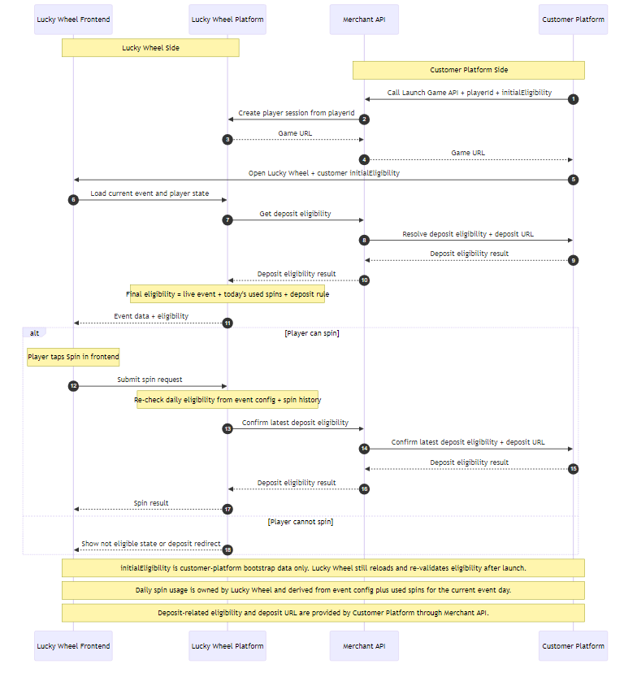

# Lucky Wheel Public Integration API Documentation

**Version:** 1.3  
**Last Updated:** March 23, 2026

---

## Table of Contents

1. [Overview](#overview)
2. [Customer Platform Onboarding](#customer-platform-onboarding)
3. [Base URL](#base-url)
4. [Authentication](#authentication)
5. [Signature Generation](#signature-generation)
6. [Common Response Format](#common-response-format)
7. [Error Codes](#error-codes)
8. [Public API Endpoints](#public-api-endpoints)
   - [Launch Game](#1-launch-game)
9. [Launch Flow](#launch-flow)
10. [Data Types](#data-types)

---

## Overview

This document describes the customer-platform-facing API contract for integrating the Lucky Wheel game.

The public integration supports:

- launching Lucky Wheel for a player
- returning a Lucky Wheel game URL
- resolving player locale in the Lucky Wheel client from browser or device settings

The public integration does **not** include:

- player balance transfer
- wallet settlement callbacks
- transfer history
- balance history
- customer-platform-facing realtime APIs

Those concerns are intentionally outside the public Lucky Wheel contract.

All public integration endpoints use **HTTP POST** and exchange **JSON** payloads.

---

## Customer Platform Onboarding

### Information Required from Customer Platform

- source IP whitelist for public integration requests
- target localization rollout requirements
- merchant operational contact
- production and sandbox calling environments

### Information Returned by Lucky Wheel Provider

- `merchantId`
- `hashKey`
- production and sandbox Merchant API base URLs
- allowed request timestamp tolerance

---

## Base URL

| Environment | Base URL |
|------------|----------|
| Production | `https://merchant-api.luckywheel.example.com/merchant-api` |
| Sandbox | `https://sandbox-merchant-api.luckywheel.example.com/merchant-api` |

All public integration endpoints are prefixed with `/integration/`.

---

## Authentication

Every public Lucky Wheel API request must include:

1. `merchantId`
2. `timestamp`
3. `hash`
4. a caller IP that is allowlisted for the merchant

### Timestamp Rules

- `timestamp` uses Unix time in seconds
- requests should be sent immediately after signature generation
- future timestamps are rejected
- requests outside the allowed time window are rejected with error `1002`

Use a tolerance target of about **10 seconds** unless a different value is provided during onboarding.

---

## Signature Generation

### Algorithm

```text
hash = SHA256(param1 + "&" + param2 + "&" + ... + "&" + hashKey)
```

### Rules

1. Concatenate parameters in the exact order defined for the endpoint
2. Join parameters with `&`
3. Append `&` and your `hashKey`
4. Compute the SHA256 digest
5. Send the lowercase hexadecimal result in `hash`

### JavaScript Example

```javascript
const crypto = require('crypto');

function generateSignature(params, hashKey) {
  const data = params.join('&') + '&' + hashKey;
  return crypto.createHash('sha256').update(data).digest('hex');
}
```

### Python Example

```python
import hashlib

def generate_signature(params, hash_key):
    data = '&'.join(params) + '&' + hash_key
    return hashlib.sha256(data.encode()).hexdigest()
```

---

## Common Response Format

All public Lucky Wheel API responses use this structure:

```json
{
  "success": true,
  "errorCode": 0,
  "errorMessage": "",
  "data": {}
}
```

| Field | Type | Description |
|-------|------|-------------|
| `success` | boolean | `true` on success, `false` on failure |
| `errorCode` | integer | `0` on success, otherwise a business error code |
| `errorMessage` | string | Empty on success, otherwise a message describing the failure |
| `data` | object/null | Response payload on success, otherwise `null` |

Public integration endpoints return HTTP `200` for both success and business errors. Always check `success` and `errorCode`.

---

## Error Codes

| Code | Name | Description |
|------|------|-------------|
| `0` | SUCCESS | Request completed successfully |
| `1001` | INVALID_SIGNATURE | Signature verification failed |
| `1002` | TIMESTAMP_EXPIRED | Timestamp is invalid or outside the allowed time window |
| `1003` | MERCHANT_NOT_FOUND | Merchant ID does not exist |
| `1004` | MERCHANT_INACTIVE | Merchant is inactive |
| `1005` | IP_NOT_ALLOWED | Caller IP is not allowlisted |
| `4000` | INVALID_REQUEST | Required request fields are missing or invalid |
| `7001` | PLATFORM_LAUNCH_FAILED | Lucky Wheel platform launch failed |
| `9999` | INTERNAL_ERROR | Internal server error |

---

## Public API Endpoints

### 1. Launch Game

Launches Lucky Wheel for a player and returns the game URL.

**Endpoint:** `POST /integration/launch`

#### Request

| Parameter | Type | Required | Description |
|-----------|------|----------|-------------|
| `merchantId` | string | Yes | Merchant ID assigned during onboarding |
| `playerId` | string | Yes | Customer-platform player identifier |
| `initialEligibility` | object | Yes | Customer-platform bootstrap eligibility snapshot used only for launch-time UX |
| `timestamp` | integer | Yes | Unix timestamp in seconds |
| `hash` | string | Yes | Request signature |

Player locale is not part of the launch request. Lucky Wheel resolves locale in the frontend from the player's browser or hardware settings, with any saved local client preference applied on top.
Lucky Wheel also does not require a separate player display name from Customer Platform. The game uses `playerId` as the player label for this integration flow.
Lucky Wheel also does not require `eventId` from Customer Platform. The game resolves the current live event from the Lucky Wheel Admin Tool configuration during launch.

#### Signature Parameters

```text
merchantId, playerId, timestamp
```

`initialEligibility` is not part of the request signature. It is customer-platform bootstrap data only.

#### Request Example

```json
{
  "merchantId": "MERCHANT001",
  "playerId": "merchant-player-789",
  "initialEligibility": {
    "depositQualified": true,
    "reasonCode": "DEPOSIT_RULE_PASSED"
  },
  "timestamp": 1761216000,
  "hash": "a1b2c3d4e5f6..."
}
```

#### Response

```json
{
  "success": true,
  "errorCode": 0,
  "errorMessage": "",
  "data": {
    "url": "https://merchant-api.luckywheel.example.com/?eventId=evt_2026_march&playerId=merchant-player-789&sessionId=lw_sess_8f6c4d8f",
    "sessionId": "lw_sess_8f6c4d8f",
    "expiresAt": "2026-03-23T10:15:00.000Z"
  }
}
```

| Field | Type | Description |
|-------|------|-------------|
| `url` | string | Lucky Wheel launch URL. The `eventId` in the URL is resolved by Lucky Wheel from the current live admin-managed event |
| `sessionId` | string | Generated Lucky Wheel session ID |
| `expiresAt` | string | Launch session expiry time in ISO 8601 format |

### Eligibility Behavior

Lucky Wheel accepts customer-platform `initialEligibility` during launch as bootstrap data only.

- `initialEligibility` is not authoritative for gameplay and is not generated by Lucky Wheel
- the Lucky Wheel frontend loads eligibility from Lucky Wheel Platform after the game opens
- Lucky Wheel Platform derives the daily-spin portion of eligibility from the current live event and the player's used spins for the current event day
- Lucky Wheel Platform also calls Merchant API, which resolves Customer Platform deposit eligibility and the Customer Platform deposit URL
- if Customer Platform says the player has not met the deposit rule, Lucky Wheel returns a `GO_TO_DEPOSIT` state and the Customer Platform deposit URL
- Lucky Wheel re-checks both daily-spin usage and deposit eligibility again before processing a spin

---

## Launch Flow

The public integration flow is shown below.



### Public Flow Summary

1. Customer Platform calls `POST /integration/launch` with `playerId` and `initialEligibility`
2. Merchant API creates a Lucky Wheel session, and Lucky Wheel resolves the current live event from its Admin Tool configuration
3. Merchant API returns the Lucky Wheel game URL
4. Customer Platform opens the Lucky Wheel frontend and may use its own `initialEligibility` as launch-time bootstrap data
5. Lucky Wheel frontend resolves locale from the player's browser or device settings, with any saved local preference applied
6. Lucky Wheel frontend loads the latest event state from Lucky Wheel Platform
7. Lucky Wheel Platform combines its own live-event and used-spin checks with Customer Platform deposit eligibility from Merchant API before allowing spin

No balance transfer or wallet callback flow exists in the public Lucky Wheel integration.

---

## Data Types

### Initial Eligibility Bootstrap

Customer Platform sends `initialEligibility` on launch as a bootstrap object. The current recommended shape is:

| Field | Type | Description |
|-------|------|-------------|
| `depositQualified` | boolean | Customer Platform's latest deposit-rule decision at launch time |
| `depositUrl` | string | Deposit URL to use when the player is not deposit-qualified |
| `reasonCode` | string | Optional bootstrap reason such as `DEPOSIT_REQUIRED` |
| `decisionId` | string | Optional Customer Platform decision reference |
| `evaluatedAt` | string | Optional ISO 8601 timestamp for the bootstrap decision |
| `expiresAt` | string | Optional ISO 8601 expiry for the bootstrap decision |

`initialEligibility` is not part of the request signature and is not authoritative for Lucky Wheel gameplay decisions.

### Eligibility Reason Codes

The current Lucky Wheel integration uses these reason codes:

| Value | Description |
|-------|-------------|
| `DAILY_SPIN_GRANTED` | Player can still use today's Lucky Wheel spin |
| `DAILY_SPIN_ALREADY_USED` | Player has already used today's Lucky Wheel spin |
| `DEPOSIT_REQUIRED` | Customer Platform says the player must deposit before spinning |
| `ARCHIVE_SNAPSHOT` | Event is not live and the archived view is read-only |
