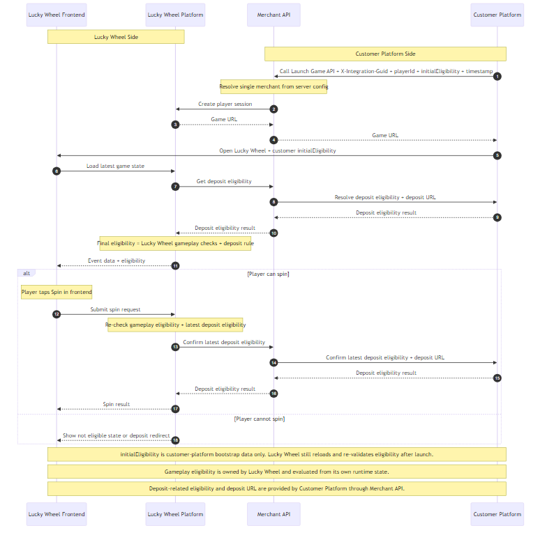

# Lucky Wheel Public Integration API Documentation

**Version:** 1.12
**Last Updated:** May 28, 2026

---

## Table of Contents

1. [Overview](#overview)
2. [Customer Platform Onboarding](#customer-platform-onboarding)
3. [Base URL](#base-url)
4. [Authentication](#authentication)
5. [Common Response Format](#common-response-format)
6. [Error Codes](#error-codes)
7. [Public API Endpoints](#public-api-endpoints)
   - [Launch Game](#1-launch-game)
8. [Deposit Eligibility Resolution](#deposit-eligibility-resolution)
9. [Launch Flow](#launch-flow)
10. [Data Types](#data-types)

---

## Overview

This document describes the customer-platform-facing API contract for integrating the Lucky Wheel game.

The public integration supports:

- launching Lucky Wheel for a player
- returning a Lucky Wheel game URL

Deposit eligibility for gameplay is resolved server-to-server after launch. Merchant API calls the Customer Platform SOAP/WCF service on behalf of Lucky Wheel Platform; player browsers never call that SOAP service directly.

Customer Platform may also pass the current-domain deposit page URL during launch. Lucky Wheel uses that URL only as the session deposit redirect when the SOAP/WCF eligibility decision says the player must deposit.


All public integration endpoints use **HTTP POST** and exchange **JSON** payloads.

---

## Customer Platform Onboarding

### Information Required from Customer Platform

- source IP whitelist for public integration requests
- target localization rollout requirements
- merchant operational contact
- production and sandbox calling environments
- production and sandbox `iBetService.svc` SOAP endpoint URLs for deposit checks
- `CompAccesskey`, `SiteID`, and required Merchant API egress IP allow-listing for the server-to-server deposit-eligibility call

### Information Returned by Lucky Wheel Provider

- shared `X-Integration-Guid` credentials for close beta/UAT and production
- production and sandbox Merchant API base URLs
- allowed request timestamp tolerance
- Merchant API egress IP information for Customer Platform SOAP allow-listing when needed

### Network Allowlist Clarification

Two different network values matter during integration:

- inbound Merchant API endpoint for Customer Platform launch requests:
  - AWS production endpoint: `https://ibetlucky.org/merchant-api/integration/launch`
  - AWS direct-IP fallback endpoint: `http://47.236.166.230:4003/merchant-api/integration/launch`
- outbound Merchant API egress IP for Customer Platform SOAP/WCF allow-listing:
  - AWS production egress IP: `47.236.166.230`

Important:

- Customer Platform should call the preferred HTTPS Merchant API launch endpoint using the full URL
- direct-IP fallback on port `4003` is for temporary connectivity testing only
- Customer Platform should allow-list only the Merchant API source IP for server-to-server deposit eligibility requests
- the Merchant API egress allow-list entry is the IP only, not `IP:port`
- Customer Platform's launch-caller public IP must also be allow-listed by Lucky Wheel Provider before launch testing

---

## Base URL

| Environment | Base URL |
|------------|----------|
| AWS Production - Preferred | `https://ibetlucky.org/merchant-api` |
| AWS Production - Direct IP Fallback | `http://47.236.166.230:4003/merchant-api` |
| Legacy GCP UAT | `http://34.81.237.79:4003/merchant-api` |

All public integration endpoints are prefixed with `/integration/`.

### AWS Production Public URLs

| Service | URL |
|---------|-----|
| Lucky Wheel game | `https://ibetlucky.org/` |
| Merchant API launch | `https://ibetlucky.org/merchant-api/integration/launch` |
| Merchant API direct-IP fallback | `http://47.236.166.230:4003/merchant-api/integration/launch` |
| AWS server origin/source IP | `47.236.166.230` |

Successful launch responses from AWS production return Lucky Wheel game URLs under `https://ibetlucky.org/`.

---

## Authentication

Every public Lucky Wheel API request must include:

1. header `X-Integration-Guid`
2. body field `timestamp`
3. a caller IP that is allowlisted for the merchant

`X-Integration-Guid` is the shared customer-platform credential assigned during onboarding. `timestamp` is used for freshness validation only.

### Environment Credentials

Use the credential that matches the target environment. `X-Integration-Guid` is shared per customer-platform environment, not per player. The `SiteID` mapping below is included only to align with the customer platform's own environment naming; `SiteID` is not sent to the public launch API.

| Environment | Customer Platform SiteID | X-Integration-Guid |
|-------------|--------------------------|--------------------|
| Close Beta / UAT | `A` | `f549b22d-b2f6-4224-aabb-0489a2cb7390` |
| Production / AWS | `C` | Use the production `X-Integration-Guid` provided separately by Lucky Wheel Provider |

### Timestamp Rules

- `timestamp` uses Unix time in seconds
- requests should be sent immediately after creation
- future timestamps are rejected
- requests outside the allowed time window are rejected with error `1002`

Use a tolerance target of **300 seconds** unless a different value is provided during onboarding.

---

## Common Response Format

All public Lucky Wheel API responses use this structure:

```json
{
  "success": true,
  "errorCode": 0,
  "errorMessage": "",
  "data": {}
}
```

| Field | Type | Description |
|-------|------|-------------|
| `success` | boolean | `true` on success, `false` on failure |
| `errorCode` | integer | `0` on success, otherwise a business error code |
| `errorMessage` | string | Empty on success, otherwise a message describing the failure |
| `data` | object/null | Response payload on success, otherwise `null` |

The AWS production launch endpoint currently returns HTTP `201` for both successful launch responses and business-level launch errors. Always check `success` and `errorCode` in the JSON body.

---

## Error Codes

| Code | Name | Description |
|------|------|-------------|
| `0` | SUCCESS | Request completed successfully |
| `1001` | INVALID_INTEGRATION_GUID | Integration GUID is missing or invalid |
| `1002` | TIMESTAMP_EXPIRED | Timestamp is invalid or outside the allowed time window |
| `1004` | MERCHANT_INACTIVE | Merchant is inactive |
| `1005` | IP_NOT_ALLOWED | Caller IP is not allowlisted |
| `4000` | INVALID_REQUEST | Required request fields are missing or invalid |
| `7001` | PLATFORM_LAUNCH_FAILED | Lucky Wheel platform launch failed |
| `9999` | INTERNAL_ERROR | Internal server error |

---

## Public API Endpoints

### 1. Launch Game

Launches Lucky Wheel for a player and returns the game URL.

**Endpoint:** `POST /integration/launch`

AWS production full endpoint:

```text
POST https://ibetlucky.org/merchant-api/integration/launch
```

Direct-IP fallback endpoint for temporary connectivity testing:

```text
POST http://47.236.166.230:4003/merchant-api/integration/launch
```

#### Request

Required header:

| Header | Required | Description |
|--------|----------|-------------|
| `X-Integration-Guid` | Yes | Shared GUID credential assigned during onboarding |

| Parameter | Type | Required | Description |
|-----------|------|----------|-------------|
| `playerId` | string | Yes | Customer-platform player identifier |
| `initialEligibility` | object | Yes | Customer-platform bootstrap eligibility snapshot used only for launch-time UX |
| `depositUrl` | string | No | Current-domain deposit page URL for this player session. Must be an absolute `http` or `https` URL. `DepositURL` is also accepted as a compatibility alias, but `depositUrl` is preferred. |
| `timestamp` | integer | Yes | Unix timestamp in seconds used for freshness validation |

Lucky Wheel also does not require a separate player display name from Customer Platform. The game uses `playerId` as the player label for this integration flow.

#### Authentication Notes

`initialEligibility` is not part of authentication. It is customer-platform bootstrap data only.

#### Header Example

```text
X-Integration-Guid: <production-guid-provided-by-lucky-wheel-provider>
```

#### Request Example

Production request URL:

```text
POST https://ibetlucky.org/merchant-api/integration/launch
```

```json
{
  "playerId": "merchant-player-789",
  "initialEligibility": {
    "depositQualified": true
  },
  "depositUrl": "https://www.customer-current-domain.com/deposit",
  "timestamp": 1761216000
}
```

#### Response

```json
{
  "success": true,
  "errorCode": 0,
  "errorMessage": "",
  "data": {
    "url": "https://ibetlucky.org/?playerId=merchant-player-789&sessionId=lw_sess_8f6c4d8f&eventId=evt_2026_march&accessToken=eyJ...",
    "sessionId": "lw_sess_8f6c4d8f",
    "expiresAt": "2026-03-23T10:15:00.000Z"
  }
}
```

| Field | Type | Description |
|-------|------|-------------|
| `url` | string | Lucky Wheel launch URL. Treat this as an opaque value and open it directly without parsing or rewriting query parameters. |
| `sessionId` | string | Generated Lucky Wheel session ID |
| `expiresAt` | string | Launch session expiry time in ISO 8601 format |

The `url` value is intentionally long because it includes a signed player access token. Treat it as opaque and open it directly.

#### Minimal cURL Example

```bash
curl -X POST "https://ibetlucky.org/merchant-api/integration/launch" \
  -H "Content-Type: application/json" \
  -H "X-Integration-Guid: <production-guid-provided-by-lucky-wheel-provider>" \
  -d '{
    "playerId": "merchant-player-789",
    "initialEligibility": {
      "depositQualified": true
    },
    "depositUrl": "https://www.customer-current-domain.com/deposit",
    "timestamp": 1780000000
  }'
```

Replace `timestamp` with the current Unix timestamp in seconds when sending a real request. Requests outside the configured freshness window return `success=false` with `errorCode=1002`.

### Eligibility Behavior

Lucky Wheel accepts customer-platform `initialEligibility` during launch as bootstrap data only.

- `initialEligibility` is not authoritative for gameplay and is not generated by Lucky Wheel
- the Lucky Wheel frontend loads eligibility from Lucky Wheel Platform after the game opens
- Lucky Wheel Platform derives the daily-spin portion of eligibility from its own gameplay state and the player's used spins
- Lucky Wheel Platform also calls Merchant API, which resolves Customer Platform deposit eligibility through the Customer Platform SOAP/WCF operation `LuckyWheel_Deposit_isEligible`
- Merchant API currently uses configured `SiteID`, `CompAccesskey`, and the Lucky Wheel event-day date to call Customer Platform server-to-server
- for the Lucky Wheel integration, the Customer Platform SOAP/WCF response only needs to return the deposit-rule decision; it does not need to return `DepositUrl`
- if the launch request includes `depositUrl`, Lucky Wheel keeps that URL on the signed player session and returns it when the player must deposit
- if `depositUrl` is omitted, Lucky Wheel falls back to the Merchant API deposit URL, which currently comes from the configured Customer Platform deposit page URL
- if Customer Platform says the player has not met the deposit rule, Lucky Wheel returns a `GO_TO_DEPOSIT` state and the Customer Platform deposit URL
- Lucky Wheel re-checks both daily-spin usage and deposit eligibility again before processing a spin

---

## Deposit Eligibility Resolution

Lucky Wheel uses a server-to-server deposit eligibility check during gameplay.

### How It Works

1. Customer Platform launches the game through `POST /integration/launch`.
2. Lucky Wheel frontend loads the latest player state from Lucky Wheel Platform after launch.
3. Lucky Wheel Platform calls Merchant API to resolve deposit eligibility for the current player and event.
4. Merchant API calls the Customer Platform SOAP/WCF service `LuckyWheel_Deposit_isEligible`.
5. Customer Platform returns the deposit-rule decision. No `DepositUrl` field is required in the SOAP/WCF response for this integration.
6. Merchant API returns the normalized eligibility result to Lucky Wheel Platform.
7. Lucky Wheel Platform combines that deposit decision with its own event and daily-spin checks before allowing spin.
8. If the result is `GO_TO_DEPOSIT`, Lucky Wheel returns the launch-time `depositUrl` for that player session when it was provided; otherwise it returns the Merchant API fallback deposit URL.

### Allow-listing Note

For Customer Platform SOAP/WCF allow-listing, use the Merchant API server's outbound source IP, not the public Merchant API listening port.

Example for the current GCP test environment:

- Customer Platform launch endpoint:
  - `http://34.81.237.79:4003/merchant-api/integration/launch`
- Merchant API outbound source IP to allow-list for SOAP/WCF:
  - `34.81.237.79`

For AWS production testing:

- Customer Platform launch endpoint:
  - preferred: `https://ibetlucky.org/merchant-api/integration/launch`
  - direct-IP fallback: `http://47.236.166.230:4003/merchant-api/integration/launch`
- Merchant API outbound source IP to allow-list for SOAP/WCF:
  - `47.236.166.230`

### Important Notes

- this Customer Platform call is server-to-server only
- player browsers do not call the Customer Platform SOAP/WCF API directly
- launch-time `initialEligibility` is bootstrap data only and is not the authoritative gameplay decision
- launch-time `depositUrl` is not an eligibility decision; it is only the redirect target used if the server-to-server eligibility decision says deposit is required
- Customer Platform should document the deposit link as a launch-API field, not as a required field in the SOAP/WCF eligibility response
- do not include secrets or one-time tokens in `depositUrl`; use a normal deposit page URL on the current customer domain
- Lucky Wheel re-checks deposit eligibility again before processing a spin request

---

## Launch Flow

The public integration flow is shown below.



### Public Flow Summary

1. Customer Platform calls `POST /integration/launch` with `playerId`, `initialEligibility`, optional `depositUrl`, `timestamp`, and the required `X-Integration-Guid` header
2. Merchant API creates a Lucky Wheel session
3. Merchant API returns the Lucky Wheel game URL
4. Customer Platform opens the Lucky Wheel frontend and may use its own `initialEligibility` as launch-time bootstrap data
5. Lucky Wheel frontend loads the latest game state from Lucky Wheel Platform
6. Lucky Wheel Platform combines its own gameplay checks with Customer Platform deposit eligibility from Merchant API before allowing spin
7. Merchant API resolves that deposit eligibility by calling the Customer Platform SOAP/WCF service, not by trusting the bootstrap `initialEligibility`


---

## Data Types

### Initial Eligibility Bootstrap

Customer Platform sends `initialEligibility` on launch as a bootstrap object. The current recommended shape is:

| Field | Type | Description |
|-------|------|-------------|
| `depositQualified` | boolean | Customer Platform's latest deposit-rule decision at launch time |

No additional bootstrap fields are required. `initialEligibility` is not part of launch authentication and is not authoritative for Lucky Wheel gameplay decisions.

### Launch Deposit URL

Customer Platform may send a top-level `depositUrl` on launch so Lucky Wheel can redirect the player back to the correct current-domain deposit page when the server-to-server deposit rule says the player must deposit.

For this integration, Customer Platform should provide the deposit link here instead of returning `DepositUrl` from `LuckyWheel_Deposit_isEligible`.

| Field | Type | Required | Description |
|-------|------|----------|-------------|
| `depositUrl` | string | No | Absolute `http` or `https` URL to the current-domain deposit page for this launched session |
| `DepositURL` | string | No | Compatibility alias accepted for customer platforms that already use this casing. Prefer `depositUrl` for new integrations. |

Rules:

- `depositUrl` is top-level in the launch request, not inside `initialEligibility`
- maximum accepted length is 2048 characters
- only absolute `http` and `https` URLs are accepted
- when both `depositUrl` and `DepositURL` are sent, `depositUrl` takes precedence
- Lucky Wheel stores this value only inside the signed player session token for the launch flow
