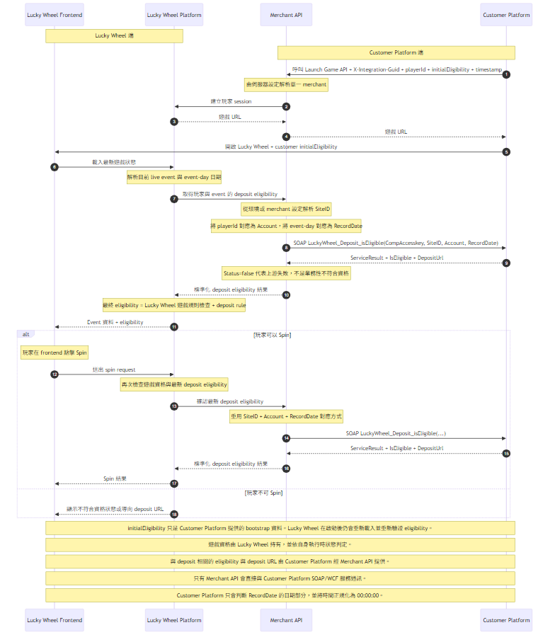

# Lucky Wheel 公開整合 API 文件

**Version:** 1.9  
**Last Updated:** April 1, 2026

---

## 目錄

1. [概述](#概述)
2. [Customer Platform 對接準備](#customer-platform-對接準備)
3. [Base URL](#base-url)
4. [驗證方式](#驗證方式)
5. [通用回應格式](#通用回應格式)
6. [錯誤碼](#錯誤碼)
7. [公開 API 端點](#公開-api-端點)
   - [啟動遊戲](#1-啟動遊戲)
8. [deposit eligibility 判定流程](#deposit-eligibility-判定流程)
9. [啟動流程](#啟動流程)
10. [資料型別](#資料型別)

---

## 概述

本文件說明 Lucky Wheel 提供給 Customer Platform 使用的公開整合 API 契約。

本公開整合目前支援：

- 為玩家啟動 Lucky Wheel
- 回傳 Lucky Wheel 遊戲網址

遊戲內使用的 deposit eligibility 會在啟動後以伺服器對伺服器方式判定。Merchant API 會代表 Lucky Wheel Platform 呼叫 Customer Platform 的 SOAP/WCF 服務；玩家瀏覽器不會直接呼叫該 SOAP 服務。

所有公開整合端點皆使用 **HTTP POST**，並以 **JSON** 交換資料。

---

## Customer Platform 對接準備

### Customer Platform 需要提供的資訊

- 公開整合請求來源 IP allowlist
- 在地化上線需求
- merchant 營運聯絡窗口
- production 與 sandbox 呼叫環境資訊
- 用於 deposit eligibility 查詢的 production 與 sandbox `iBetService.svc` SOAP 端點 URL
- 供伺服器對伺服器 deposit eligibility 查詢使用的 `CompAccesskey`、`SiteID` 與 Merchant API 對外 IP allowlist 需求

### Lucky Wheel Provider 會提供的資訊

- 共用的 `X-Integration-Guid` 憑證
- production 與 sandbox 的 Merchant API base URL
- 可接受的請求時間戳記誤差範圍
- 若 Customer Platform 需要設定 SOAP allowlist，Lucky Wheel 會提供 Merchant API 對外 IP 資訊

---

## Base URL

| Environment | Base URL |
|------------|----------|
| Production | `https://merchant-api.luckywheel.example.com/merchant-api` |
| Sandbox | `https://sandbox-merchant-api.luckywheel.example.com/merchant-api` |

所有公開整合端點皆以 `/integration/` 為前綴。

---

## 驗證方式

每一個公開 Lucky Wheel API 請求都必須包含：

1. header `X-Integration-Guid`
2. body 欄位 `timestamp`
3. 已加入 merchant allowlist 的來源 IP

`X-Integration-Guid` 是對接期間提供給 Customer Platform 的共用憑證。`timestamp` 僅用於 freshness validation。

### Timestamp 規則

- `timestamp` 使用 Unix time 秒數
- 請求建立後應立即送出
- 未來時間戳記會被拒絕
- 超出允許時間範圍的請求會回傳錯誤 `1002`

除非對接期間另有約定，建議使用 **300 秒** 的容許範圍。

---

## 通用回應格式

所有公開 Lucky Wheel API 回應皆採用以下結構：

```json
{
  "success": true,
  "errorCode": 0,
  "errorMessage": "",
  "data": {}
}
```

| Field | Type | Description |
|-------|------|-------------|
| `success` | boolean | 成功時為 `true`，失敗時為 `false` |
| `errorCode` | integer | 成功時為 `0`，否則為業務錯誤碼 |
| `errorMessage` | string | 成功時為空字串，失敗時為錯誤訊息 |
| `data` | object/null | 成功時為回應資料，失敗時為 `null` |

公開整合端點在成功與業務錯誤情況下都會回傳 HTTP `200`。請務必檢查 `success` 與 `errorCode`。

---

## 錯誤碼

| Code | Name | Description |
|------|------|-------------|
| `0` | SUCCESS | 請求成功完成 |
| `1001` | INVALID_INTEGRATION_GUID | Integration GUID 缺失或無效 |
| `1002` | TIMESTAMP_EXPIRED | Timestamp 無效或超出允許時間範圍 |
| `1004` | MERCHANT_INACTIVE | Merchant 未啟用 |
| `1005` | IP_NOT_ALLOWED | 呼叫來源 IP 不在 allowlist 中 |
| `4000` | INVALID_REQUEST | 必填欄位缺失或格式不正確 |
| `7001` | PLATFORM_LAUNCH_FAILED | Lucky Wheel 平台啟動失敗 |
| `9999` | INTERNAL_ERROR | 內部伺服器錯誤 |

---

## 公開 API 端點

### 1. 啟動遊戲

啟動 Lucky Wheel 並回傳遊戲網址。

**Endpoint:** `POST /integration/launch`

#### Request

必要 header：

| Header | Required | Description |
|--------|----------|-------------|
| `X-Integration-Guid` | Yes | 對接期間提供的共用 GUID 憑證 |

| Parameter | Type | Required | Description |
|-----------|------|----------|-------------|
| `playerId` | string | Yes | Customer Platform 的玩家識別碼 |
| `initialEligibility` | object | Yes | 僅用於啟動時 UX 的 Customer Platform bootstrap eligibility snapshot |
| `timestamp` | integer | Yes | 用於 freshness validation 的 Unix timestamp 秒數 |

Lucky Wheel 不需要 Customer Platform 額外提供玩家顯示名稱。此整合流程會直接以 `playerId` 作為玩家標示。

#### 驗證說明

`initialEligibility` 不屬於驗證內容。它只是 Customer Platform 提供的 bootstrap 資料。

#### Header 範例

```text
X-Integration-Guid: 11111111-1111-1111-1111-111111111111
```

#### Request 範例

```json
{
  "playerId": "merchant-player-789",
  "initialEligibility": {
    "depositQualified": true
  },
  "timestamp": 1761216000
}
```

#### Response

```json
{
  "success": true,
  "errorCode": 0,
  "errorMessage": "",
  "data": {
    "url": "https://merchant-api.luckywheel.example.com/?playerId=merchant-player-789&sessionId=lw_sess_8f6c4d8f",
    "sessionId": "lw_sess_8f6c4d8f",
    "expiresAt": "2026-03-23T10:15:00.000Z"
  }
}
```

| Field | Type | Description |
|-------|------|-------------|
| `url` | string | Lucky Wheel 啟動網址 |
| `sessionId` | string | 產生的 Lucky Wheel session ID |
| `expiresAt` | string | 啟動 session 的 ISO 8601 到期時間 |

### Eligibility 行為

Lucky Wheel 在啟動時會接受 Customer Platform 提供的 `initialEligibility`，但僅將其視為 bootstrap 資料。

- `initialEligibility` 並非遊戲內最終權威資格結果，也不是由 Lucky Wheel 產生
- Lucky Wheel frontend 在遊戲開啟後，會從 Lucky Wheel Platform 載入最新 eligibility
- Lucky Wheel Platform 會依自身遊戲狀態與玩家已使用的 spins，判定每日 spin 相關資格
- Lucky Wheel Platform 也會呼叫 Merchant API，由 Merchant API 透過 Customer Platform SOAP/WCF 的 `LuckyWheel_Deposit_isEligible` 作業查詢 deposit eligibility
- Merchant API 目前會使用設定好的 `SiteID`、`CompAccesskey` 與 Lucky Wheel event-day 日期，以伺服器對伺服器方式呼叫 Customer Platform
- 目前 live WSDL 會回傳 eligibility 判定，但尚未提供 deposit URL，因此 Merchant API 會在需要導向 deposit 時使用已設定的 Customer Platform deposit URL
- 若 Customer Platform 判定玩家尚未符合 deposit rule，Lucky Wheel 會回傳 `GO_TO_DEPOSIT` 狀態與 Customer Platform 的 deposit URL
- Lucky Wheel 在實際處理 spin 前，會再次檢查每日 spin 使用情況與 deposit eligibility

---

## deposit eligibility 判定流程

Lucky Wheel 在遊戲進行期間，會以伺服器對伺服器方式查詢 deposit eligibility。

### 運作方式

1. Customer Platform 透過 `POST /integration/launch` 啟動遊戲。
2. Lucky Wheel frontend 在啟動後，從 Lucky Wheel Platform 載入最新玩家狀態。
3. Lucky Wheel Platform 呼叫 Merchant API，為目前玩家與 event 查詢 deposit eligibility。
4. Merchant API 呼叫 Customer Platform SOAP/WCF 服務 `LuckyWheel_Deposit_isEligible`。
5. Customer Platform 回傳 deposit rule 判定結果。
6. Merchant API 將標準化後的 eligibility 結果回傳給 Lucky Wheel Platform。
7. Lucky Wheel Platform 再將該 deposit 結果與自身 event 與每日 spin 規則一起判定，決定玩家是否可 spin。

### 重要說明

- 此 Customer Platform 呼叫僅為伺服器對伺服器流程
- 玩家瀏覽器不會直接呼叫 Customer Platform SOAP/WCF API
- 啟動時提供的 `initialEligibility` 只是 bootstrap 資料，不是最終權威遊戲資格結果
- Lucky Wheel 在處理 spin request 前，會再次查詢 deposit eligibility

---

## 啟動流程

公開整合流程如下圖所示。



### 公開流程摘要

1. Customer Platform 帶入 `playerId`、`initialEligibility`、`timestamp` 與必要的 `X-Integration-Guid` header 呼叫 `POST /integration/launch`
2. Merchant API 建立 Lucky Wheel session
3. Merchant API 回傳 Lucky Wheel 遊戲網址
4. Customer Platform 開啟 Lucky Wheel frontend，並可使用自己的 `initialEligibility` 作為啟動 bootstrap 資料
5. Lucky Wheel frontend 向 Lucky Wheel Platform 載入最新遊戲狀態
6. Lucky Wheel Platform 在允許 spin 前，會將自身遊戲檢查結果與來自 Merchant API 的 Customer Platform deposit eligibility 一起判定
7. Merchant API 會透過 Customer Platform SOAP/WCF 服務查詢該 deposit eligibility，而不是直接信任 bootstrap `initialEligibility`

---

## 資料型別

### Initial Eligibility Bootstrap

Customer Platform 在啟動時傳送 `initialEligibility` 作為 bootstrap 物件。目前建議的結構如下：

| Field | Type | Description |
|-------|------|-------------|
| `depositQualified` | boolean | Customer Platform 當下最新的 deposit rule 判定結果 |

目前不需要其他 bootstrap 欄位。`initialEligibility` 不屬於啟動驗證內容，也不是 Lucky Wheel 遊戲資格判定的最終依據。
