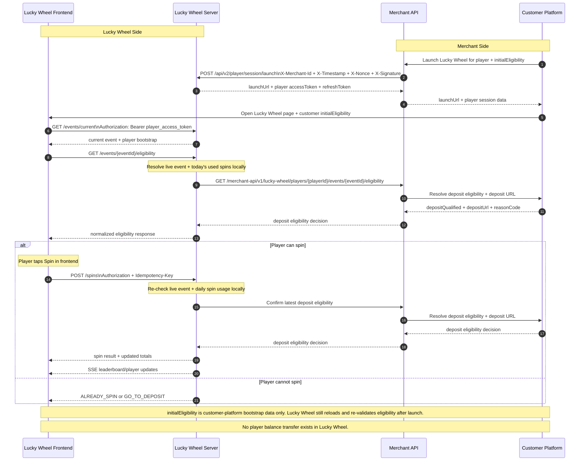

# Lucky Wheel Dataflow Diagram

This diagram follows the sample sequence style and reflects the current Lucky Wheel production contract.

Key differences from the sample:

- Lucky Wheel does not transfer player balance.
- There is no `LoginPlayer` callback or wallet-transfer branch.
- Player is not shown as a separate swimlane; player actions happen through Lucky Wheel Frontend.
- Player launch data enters from Customer Platform through Merchant API before the Lucky Wheel client opens.
- Customer Platform still sends `initialEligibility` as launch-time bootstrap data.
- Lucky Wheel Server owns live-event and daily-spin usage checks.
- Merchant API is used for launch orchestration and deposit-eligibility lookup only.
- Customer Platform only decides deposit-related eligibility and deposit URL.

