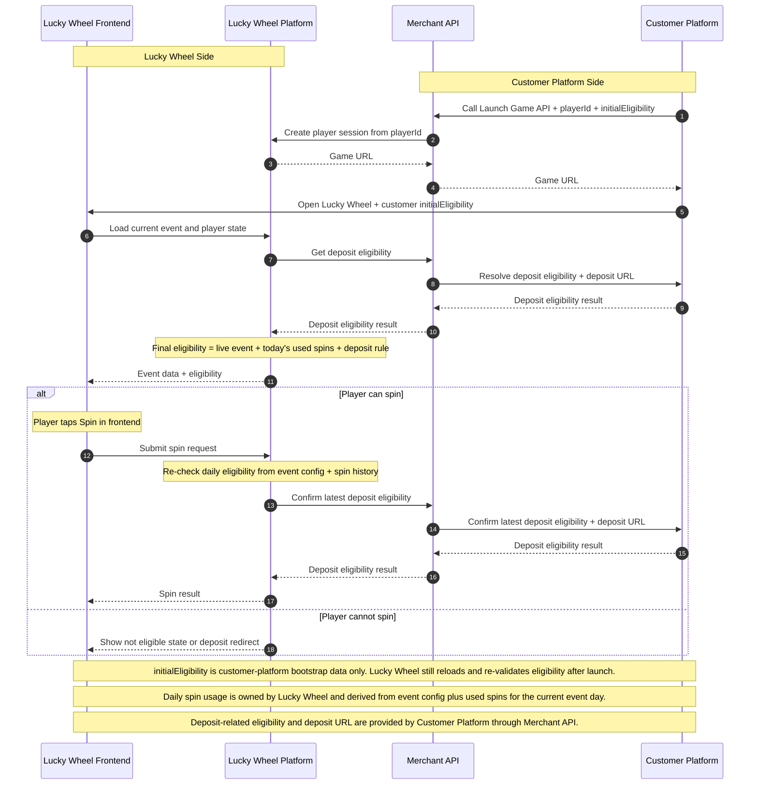

# Lucky Wheel Public API Integration Diagram

This diagram is a public-facing integration view for customer platform teams.

What is intentionally hidden:

- private headers, signatures, and token fields
- internal Lucky Wheel server endpoints
- internal realtime and leaderboard update details
- player is not shown as a separate swimlane; player actions happen through Lucky Wheel Frontend

