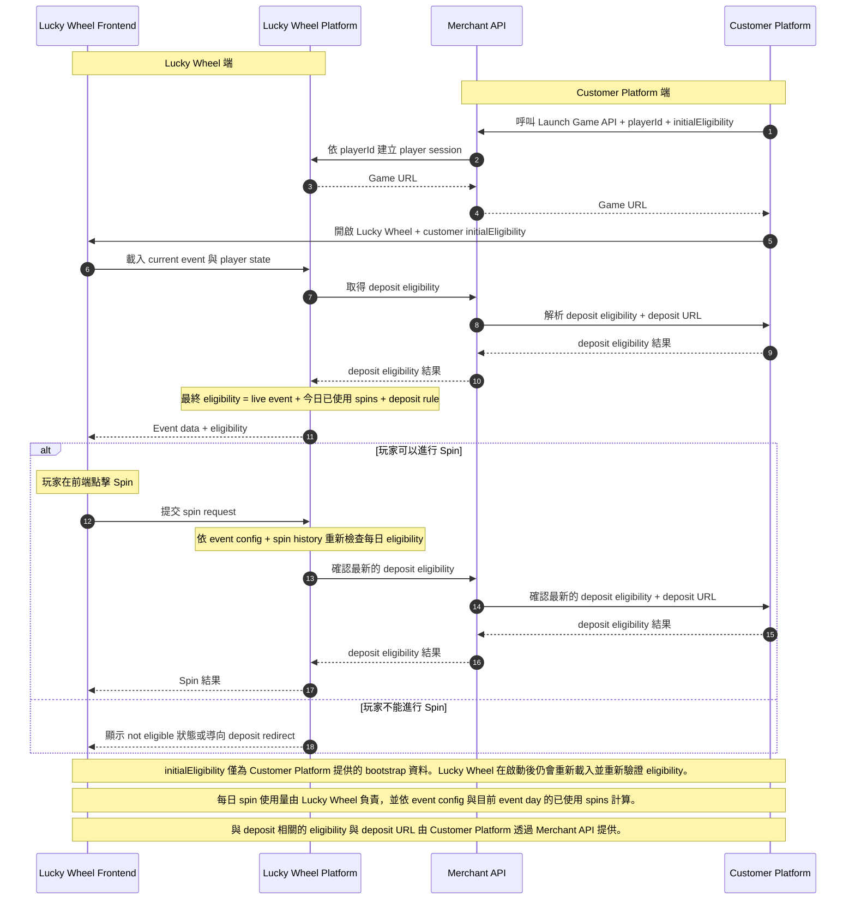

# Lucky Wheel 公開 API 整合流程圖

這是提供給 Customer Platform 團隊的公開整合視圖繁體中文版。

刻意隱藏的內容：

- 私有 headers、signatures 與 token 欄位
- Lucky Wheel server 內部 endpoints
- 內部 realtime 與 leaderboard 更新細節
- 不另外顯示玩家泳道；玩家操作皆透過 Lucky Wheel Frontend 發生

