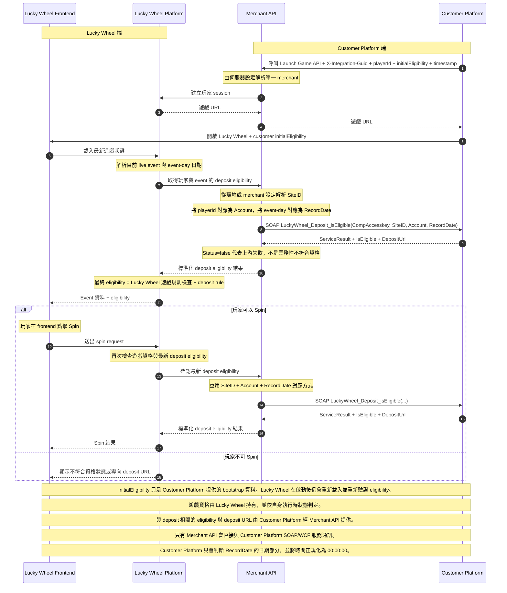

# Lucky Wheel 公開 API 整合流程圖

此圖提供 Customer Platform 團隊使用的公開整合視圖。

刻意不顯示的內容：

- 此公開流程不需要知道的 token 欄位與內部 headers
- Lucky Wheel Server 內部端點
- 內部 realtime 與 leaderboard 更新細節
- 玩家不另外顯示成獨立 swimlane；玩家操作皆透過 Lucky Wheel Frontend 進行

